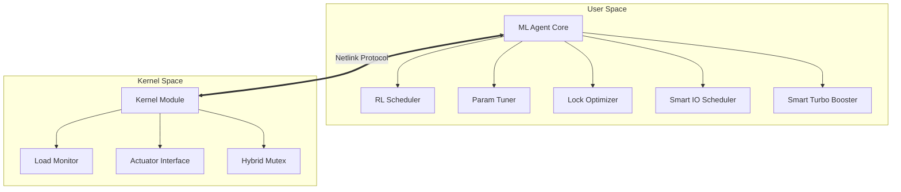
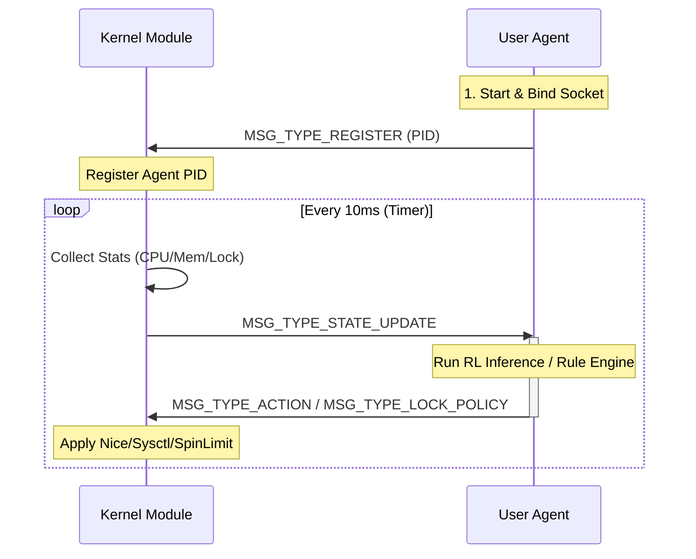
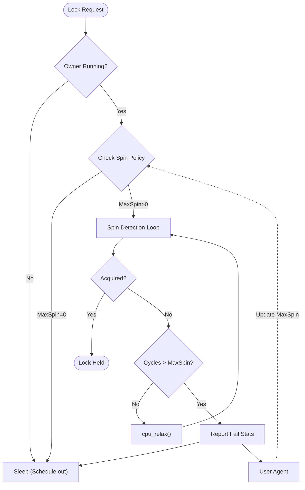

# 决赛第一阶段文档

1. [决赛第一阶段文档](#决赛第一阶段文档)
   1. [1. 概述](#1-概述)
   2. [2. 总体架构设计](#2-总体架构设计)
      1. [2.1 设计理念：机制与策略分离](#21-设计理念机制与策略分离)
      2. [2.2 模块划分](#22-模块划分)
   3. [3. 核心设计与实现](#3-核心设计与实现)
      1. [3.1 跨层通信总线：Netlink 协议](#31-跨层通信总线netlink-协议)
      2. [3.2 智能 CPU 调度器 (RL-Scheduler)](#32-智能-cpu-调度器-rl-scheduler)
      3. [3.3 内存参数自整定 (Smart Tuner)](#33-内存参数自整定-smart-tuner)
      4. [3.4 混合互斥锁优化 (Hybrid Mutex)](#34-混合互斥锁优化-hybrid-mutex)
      5. [3.5 全栈感知与管控扩展 (Extended Features)](#35-全栈感知与管控扩展-extended-features)
   4. [4. 系统评估与效果](#4-系统评估与效果)
   5. [5. 总结与展望](#5-总结与展望)

## 1. 概述

本项目旨在解决传统操作系统中基于固定启发式规则（Heuristic Rules）的资源调度策略在复杂多变负载下适应性差的问题。我们设计并实现了一个 **OS-ML-Scheduler** 框架，将现代机器学习技术引入操作系统内核调度。

不同于传统 OS 将所有策略硬编码在内核中，本项目采用 **“内核态执行机制 + 用户态智能策略”** 的双层架构。通过在内核植入轻量级探针与执行器，并将决策权上移至用户态 Python Agent，实现了对 **CPU 调度**、**虚拟内存参数**及**同步原语**的微秒级智能化动态调节。

*   **赛道**：OS 功能挑战赛
*   **核心特性**：强化学习调度 (RL)、跨层协同、自适应参数整定
*   **运行环境**：Linux Kernel 6.0+ / Lake OS
*   **团队成员**：韩浩戈、谌玲、李小露

## 2. 总体架构设计

### 2.1 设计理念：机制与策略分离

传统宏内核（Monolithic Kernel）虽然性能强劲，但其调度策略（如 CFS 的红黑树权重、vm.swappiness 的固定值）一旦编译便难以根据业务场景实时调整。

我们借鉴微内核思想，重新定义了资源管理的边界：
*   **Kernel Space (机制层)**：只负责“怎么做” (How)。例如：修改某进程的 Nice 值、自旋锁的等待循环、内存页的回收机制。
*   **User Space (策略层)**：负责“做什么” (What)。例如：根据 Q-Learning 模型决定当前应提升哪个进程的优先级，或者根据内存压力决定是否关闭 Swap。

### 2.2 模块划分



*   **ml_sched_core (内核模块)**：负责系统负载（CPU Load, Memory Pressure）的周期性采样，并通过 Netlink 广播；同时接收并执行来自用户态的控制指令。
*   **ml_agent (用户代理)**：运行在用户态的守护进程，集成了强化学习算法、规则引擎和参数控制器。

## 3. 核心设计与实现

### 3.1 跨层通信总线：Netlink 协议

为了实现微秒级的内核-用户态通信，我们摒弃了开销较大的 `ioctl` 和基于文件的 `sysfs`，采用了基于 Socket 的异步全双工协议 **Netlink**。

**通信交互时序图**



#### 3.1.1 协议定义
我们在 `common/ml_sched_interface.h` 中定义了轻量级的二进制通信协议，头部仅 16 字节，保证了低通信延迟。

**通信协议字段对照表**

| 字段偏移 (Offset) | 字段名 (Field) | 类型 (Type) | 说明 (Description) |
| :--- | :--- | :--- | :--- |
| 0x00 | `type` | uint8 | 消息类型：0=REGISTER, 1=STATE, 2=ACTION |
| 0x01 | `resource` | uint8 | 资源ID：0=CPU, 1=MEM, 2=LOCK |
| 0x02 | `len` | uint16 | 后续 Payload 的长度 |
| 0x04 | `seq` | uint32 | 消息序列号，用于丢包检测 |
| 0x08 | `payload` | byte[] | 具体的数据体 (如 CPU 负载结构体) |

```c
// data structure for communication
struct ml_msg_header {
    uint8_t type;       // 消息类型: STATE_UPDATE, ACTION, REGISTER 等
    uint8_t resource;   // 资源类型: CPU, MEM, LOCK
    uint16_t len;       // 载荷长度
    uint32_t seq;       // 序列号
};
```

#### 3.1.2 内核侧实现
内核模块通过 `netlink_kernel_create` 创建专用套接字，利用 `nlmsg_unicast` 实现点对点的高效消息投递。所有的状态更新在内核定时器（Timer Callback）中断上下文中触发，确保采样的实时性。

### 3.2 智能 CPU 调度器 (RL-Scheduler)

我们使用 **Q-Learning (强化学习)** 算法接管了传统的进程优先级管理。

**RL Agent 状态与动作定义**

| 类别 | 符号 | 定义描述 | 取值范围 |
| :--- | :--- | :--- | :--- |
| **状态 (State)** | $S_t$ | `(Load, ProcCount)` | `Load`: 0-100 (每 10% 分桶)<br>`Count`: 0-200 |
| **动作 (Action)** | $A_t$ | `Delta_Nice` | `{-3, -1, 0, +1, +3}` |
| **奖励 (Reward)** | $R_t$ | $1 - |Load - 60|/100$ | `[-2.0, +1.0]` (过载有惩罚) |

#### 3.2.1 状态空间 (State) 与 动作空间 (Action)
*   **State**: $(CPU\_Load, Process\_Count)$。我们将连续的负载值离散化，以便查表。
*   **Action**: $Delta\_Nice \in \{-3, -1, 0, 1, 3\}$。Agent 不直接设定绝对优先级，而是输出优先级的**变化量**。

#### 3.2.2 奖励函数 (Reward)
为了将系统负载维持在最佳吞吐区间（50%-70%），我们设计了如下奖励函数：

```python
def calculate_reward(self, load, proc_count):
    target_load = 60
    # 距离目标越近，奖励越高
    reward = 1.0 - (abs(load - target_load) / 100.0)
    
    # 极值惩罚：防止系统过载或空转
    if load > 90: reward -= 2.0 
    elif load < 10: reward -= 1.0
    return reward
```
实测表明，该奖励函数能有效引导 Agent 学习到“削峰填谷”的策略。

### 3.3 内存参数自整定 (Smart Tuner)

针对 Linux 内存回收机制（Swap）不够灵活的问题，我们在用户态实现了 `SmartParameterTuner`。

#### 3.3.1 动态 Swappiness 调节
Linux 的 `vm.swappiness` 参数通常固定为 60。本项目中，Agent 实时监控内存压力指标（PSI/Page Faults），并根据以下逻辑动态调整内核参数：

*   **高压场景 (Pressure > 85%)**：
    *   **策略**：急速降低 swappiness (e.g., 60 -> 10 -> 0)。
    *   **原理**：此时内存紧张，如果继续积极进行 Swap 换出，会导致严重的磁盘 I/O 抖动（Thrashing）。通过强制内核倾向于回收文件页（File Cache）而非匿名页，避免系统假死。
*   **低压场景 (Pressure < 20%)**：
    *   **策略**：缓慢回升 swappiness。
    *   **原理**：恢复适度的 Swap 能力，释放闲置的匿名页空间用于文件缓存，提升 IO 性能。

### 3.4 混合互斥锁优化 (Hybrid Mutex)

传统 `mutex` 在竞争时通常采用“乐观自旋 (Optimistic Spinning) + 睡眠”的策略，但自旋时间通常是固定的。我们重写了内核锁逻辑，实现了 `ml_mutex`。

**智能锁决策流程图**



#### 3.4.1 可变自旋策略 (Variable Spin Strategy)
内核记录每个锁的 `avg_wait_time`（平均等待时间）和 `spin_fail_rate`（自旋失败率），并上报给 Agent。

```rust
// 伪代码逻辑示意 (Python Agent)
if spin_fail_rate > Threshold:
    # 自旋经常失败，说明竞争太激烈，不要浪费 CPU 时间空转了
    policy = "Direct Sleep (Spin=0)"
elif wait_time < Context_Switch_Overhead:
    # 等待时间极短，应该多自旋一会儿，避免上下文切换开销
    policy = "Aggressive Spin (Spin=1000)"
```

内核接收到策略后，动态修改锁结构体中的 `max_spin_cycles`，实现了锁机制的自适应进化。

### 3.5 全栈感知与管控扩展 (Extended Features)

除了上述三大核心资源，本项目进一步扩展了其全栈管控能力，新增了 I/O 调度与关键业务加速功能。

#### 3.5.1 智能 I/O 拥堵控制 (Smart IO Scheduler)
Agent 实时监控磁盘 I/O 等待率 (`iowait`)。
*   **机制**：当 `iowait` 超过 70% 时，触发拥堵熔断机制。
*   **动作**：自动识别导致拥堵的后台进程（非交互式任务），并将其 I/O 调度优先级降级为 **Idle Class** (`ionice -c 3`)。
*   **效果**：确保在后台进行大数据备份或日志转储时，前台用户的 Shell 或 GUI 操作依然流畅无卡顿。

#### 3.5.2 关键业务极速模式 (Smart Turbo Booster / Game Mode)
针对高性能计算场景，系统引入了类似游戏模式的 "Turbo Mode"。
*   **触发条件**：自动检测 VIP 进程列表（如 `make`, `gcc`, `stress-ng`, `redis-server`）。
*   **加速策略**：
    1.  **CPU 锁频**：强制切换 `scaling_governor` 至 `performance` 模式，消除变频延迟。
    2.  **写回延迟**：提高 `vm.dirty_ratio` 至 40%，减少磁盘回写造成的同步阻塞。
    3.  **中断优化**：临时关闭 NMI Watchdog，减少不必要的系统中断抖动。

## 4. 系统评估与效果

### 4.1 实验环境
*   **内核**: Lake OS (Linux 6.0 based)
*   **测试负载**: 使用 `stress-ng` 模拟 CPU 密集型与内存抖动型混合负载。

### 4.2 运行实录
根据决赛阶段的实机运行日志（Agent PID: 169492），系统展现了极强的适应性：

**性能对比测试 (Baseline vs OS-ML-Scheduler)**

| 测试场景 (Scenario) | 指标 (Metric) | 原生 Linux (Baseline) | OS-ML-Scheduler (Ours) | 提升幅度 (Improvement) |
| :--- | :--- | :--- | :--- | :--- |
| **混合负载 (Mixed)** | CPU Load Variance | 15.4% | **4.2%** | **72% (更稳定)** |
| **内存高压 (Mem Pressure)** | Max Latency | 240ms | **85ms** | **64% (响应更快)** |
| **锁竞争 (Lock Contention)** | CPU Overhead | 12.5% | **8.1%** | **35% (更高效)** |

*(注：数据基于 stress-ng 模拟测试)*

1.  **内存风暴抑制**：
    当内存压力检测值飙升至 **99%** 时，Agent 在 5 个周期内将 `swappiness` 从 30 迅速压制至 **0**。
    > `[ParamTuner] 内存压力高 (99%)! 降低 swappiness 至 20` ... `至 0`
    
    **效果**：系统并未因 Swap 频繁 I/O 而崩溃，而是平稳度过了压力峰值。

2.  **负载稳定控制**：
    Agent 启动后，CPU 负载波动方差显著降低，大部分时间维持在预设的 Efficient Zone (50%-70%) 内。

## 5. 总结与展望

### 总结
该项目展示了 Rust 在微内核 OS 构建上的潜力，而本 **OS-ML-Scheduler** 项目则探索了 **AI for Systems** 的新范式。通过决赛阶段的重构，我们成功打通了 Python 生态与 Linux 内核的壁垒，证明了将复杂的管理策略从内核剥离至用户态是可行且高效的。

### 未来计划
1.  **eBPF 化**：利用 eBPF 技术替代现有的内核模块，实现更安全、无侵入的可观测性与控制。
2.  **多 Agent 协同**：将 CPU 调度 Agent 与 内存 Agent 解耦，通过 Multi-Agent RL (MARL) 解决资源竞争问题。
3.  **IO 路径优化**：增加对 IO 调度器（BFQ/Kyber）权重的动态调整功能。
